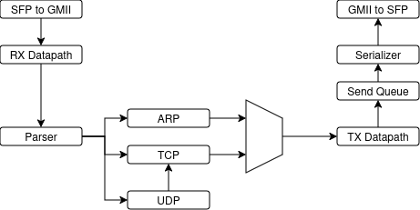

# RTL-NIC v0

RTL-NIC v0 is a custom SystemVerilog RTL architecture for FPGA Ethernet
receive and transmit datapaths with ARP, IPv4, UDP, and specialized TCP
handling. The design includes four-way connection-tuple lookup, 64 TCP control
block entries, centralized state writeback, connection establishment and state
transitions, retransmission-timeout scheduling, transmit-frame construction,
and a 1 Gb/s Xilinx PCS/PMA integration.

This repository is a source-available architectural snapshot derived from the
broader private TradingNIC implementation. It preserves an inspectable version
of the design under a custom license; it is not presented as open source.

**Demo video:** [Watch the project demonstration on LinkedIn](https://www.linkedin.com/feed/update/urn:li:activity:7478089963419369472/)

The receive path carries byte-wide GMII traffic from the PCS/PMA into
`rx_datapath`, which detects the preamble/SFD and decodes Ethernet, ARP, IPv4,
TCP, and UDP fields. ARP traffic is routed to the ARP subsystem, while matching
IPv4/TCP traffic and the fixed-format UDP application interface feed the TCP
control path.

The transmit path accepts ARP and TCP descriptors, constructs Ethernet frames
with IPv4 and TCP checksums where applicable, queues each frame, and serializes
the preamble, padded frame body, FCS, and inter-frame gap onto GMII.

## Technical Highlights

- A four-way connection-tuple cache maps IPv4 source/destination addresses and
  TCP source/destination ports to TCB addresses.
- Two matrix-based Toeplitz hash results provide alternative lookup and
  placement locations for the connection cache.
- A 64-entry true dual-port TCB store holds per-connection transport state.
- Received TCP traffic and application requests share the tuple-cache lookup
  pipeline through a common arbiter.
- `tcb_mgr` coordinates the control paths and commits their updates through a
  centralized state-writeback path.
- Active connection requests can wait in an eight-entry pending table while ARP
  resolves the destination MAC address.
- `tcp_ctrl` and `tcp_fsm` implement specialized connection establishment,
  acknowledgment processing, response generation, and connection-state
  transitions.
- The RTO path combines timer-wheel scheduling, cancellation, immediate
  priority work, and increasing retry-backoff state.
- The ARP subsystem provides a four-way, 16-set cache with passive learning,
  request/reply generation, retry handling, and stale-entry aging.
- The transmit datapath constructs ARP and IPv4/TCP frames, calculates IPv4 and
  TCP checksums, adds minimum-frame padding and Ethernet FCS, emits the Ethernet
  preamble/SFD, and serializes the result over GMII.
- The public top level integrates a Xilinx Gigabit Ethernet PCS/PMA at 1 Gb/s
  through a 125 MHz GMII datapath.

## Where to Start

- [`rtl/top_level.sv`](rtl/top_level.sv) connects the PCS/PMA, GMII receive and
  transmit paths, ARP, TCP, and the fixed-format UDP application entry point.
- [`rtl/tcp_top_level.sv`](rtl/tcp_top_level.sv) integrates TCP lookup, TCB
  management, ARP resolution, timeout scheduling, and the public payload-memory
  interface boundary.
- [`rtl/cache.sv`](rtl/cache.sv) implements the four-way hashed connection-tuple
  cache and maps flows to the 64-entry TCB address space.
- [`rtl/tcb_mgr.sv`](rtl/tcb_mgr.sv) sequences TCB reads, control operations,
  centralized commits, descriptor issue, and RTO interaction.
- [`rtl/tcp_ctrl.sv`](rtl/tcp_ctrl.sv) updates TCP sequence, acknowledgment,
  timeout, and response state for received segments.
- [`rtl/tcp_fsm.sv`](rtl/tcp_fsm.sv) defines the implemented TCP connection
  states, transitions, response flags, and invalidation behavior.
- [`rtl/tx_datapath.sv`](rtl/tx_datapath.sv) formats ARP and IPv4/TCP frames and
  calculates IPv4 and TCP checksums.
- [`rtl/arp_top_level.sv`](rtl/arp_top_level.sv) joins ARP receive, lookup,
  learning, reply, retry, and stale-entry handling.
- [`rtl/rto.sv`](rtl/rto.sv) schedules TCB addresses through the timeout
  timer-wheel and immediate-priority paths.
- [`rtl/packages.sv`](rtl/packages.sv) defines the shared protocol constants,
  structures, descriptors, requests, and TCB types.

## Documentation

- [Top-level architecture](docs/architecture.md)
- [TCP architecture](docs/tcp-architecture.md)
- [TCP behavior and limitations](docs/tcp.md)
- [ARP behavior and limitations](docs/arp.md)

## Public Snapshot Scope and Limitations

The transmit-payload memory subsystem is intentionally excluded because it is
shared with ongoing private architectural work.

- This public snapshot is not a standalone build. The retained TCP integration
  still references the excluded transmit-payload memory interface.
- Complete transmit-payload replay is unavailable without that subsystem, and a
  complete retransmission datapath is not integrated.
- IPv4 and TCP receive checksums are decoded but are not validated before TCP
  state updates.
- Receive payload delivery, out-of-order buffering, and stream reassembly are
  not implemented.
- TCP options, congestion control, receive-window enforcement, and timed
  `TIME_WAIT` behavior are not implemented.
- Some backpressure and overflow policies, including pending-ARP exhaustion and
  internal queue overflow handling, remain incomplete.
- Generated vendor IP, constraints, testbenches, build artifacts, and
  project-recreation scripts are not included.
- The implementation is a specialized hardware transport engine, not a
  general-purpose TCP/IP stack.

## Project Context

RTL-NIC v0 preserves an earlier architecture whose lessons informed a newer
private design, including changes to flow ownership, parallelism, loss recovery,
throughput, and 10 Gb/s MAC/PCS integration. The newer implementation remains
private; this release is presented as an architectural snapshot in its own
right.

## IP Cores and Build Dependencies

The public SystemVerilog modules are included under [`rtl/`](rtl/). In addition
to the excluded transmit-payload memory subsystem, `top_level` depends on these
AMD/Xilinx Vivado components:

- `gig_ethernet_pcs_pma_0` Gigabit Ethernet PCS/PMA IP;
- `xpm_fifo_sync` and `xpm_memory_tdpram` Xilinx Parameterized Macros; and
- `IBUFDS`, `BUFG`, and `BUFGCE_DIV` device primitives.

These vendor components and their generated output products are not included
and are not licensed under the RTL-NIC license. They must be supplied or
generated using an appropriately licensed Vivado installation and remain
subject to AMD/Xilinx license terms.

## AI-Assisted Development Disclosure

Generative AI was used for documentation editing, source-comment editing,
design review, and limited mechanical code cleanup. The architecture, RTL
design decisions, core implementation, integration, and responsibility for
validation remained with the project author.

Detailed disclosure

All architectural concepts, design choices, and original project ideas are the
work of Haruto Iguchi. AI assisted in reviewing those ideas, challenging
assumptions, and assessing whether proposed approaches appeared practical; this
assistance was not independent RTL verification.

The RTL was implemented largely by Haruto Iguchi with minimal AI involvement.
Code assistance was generally limited to routine tasks such as moving modules,
rewiring existing interfaces, creating temporary debug signals, minor checks,
and small cleanup suggestions.

A substantial portion of the documentation and source-code comments was
generated, rewritten, or cleaned up with AI assistance. Documentation and
comments are explanatory material rather than verification evidence, and final
design and publication decisions remain with the project author.

## License

Copyright (c) 2026 Haruto Iguchi. All Rights Reserved.

RTL-NIC is source-available under the custom terms in [LICENSE](LICENSE).
The license permits educational, noncommercial academic, personal hobby, and
narrow employment-evaluation use. Commercial use and redistribution outside
the license's limited permissions require a separate written license from the
copyright holder.
