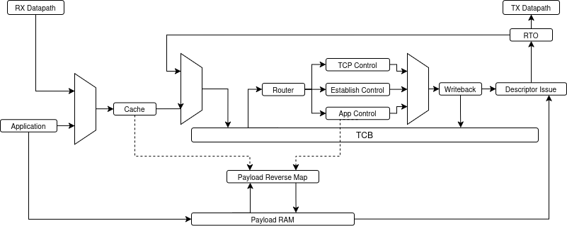

# TCP Architecture

The TCP datapath uses the TCB as the committed source of per-connection state.
A tuple cache accelerates connection lookup, while `tcb_mgr` coordinates state
reads, control decisions, application requests, writeback, descriptor issue,
and retransmission timeout scheduling.

## Request Flow

The cache arbiter selects between received TCP headers and queued application
requests. The selected IPv4/TCP tuple is looked up in `cache`, which returns a
six-bit TCB address or allocates an address for an eligible miss.

Received traffic is routed through `tcp_ctrl` and `tcp_fsm`. Application
requests are routed through `app_ctrl`, and new connections use
`establish_ctrl` after ARP resolution. These paths converge on the centralized
writeback path in `tcb_mgr`.

## TCB Ownership

The TCB is implemented as a 64-entry true dual-port memory:

- Port A commits state selected by the merged writeback path.
- Port B supplies state for the control and application pipelines.
- `writeback` prioritizes received-packet work and queues the other request
  classes.
- Invalidating a connection clears its TCB entry and associated allocation
  state.

Centralizing writes avoids multiple control blocks driving the same state
memory independently.

## Payload and Descriptor Paths

The public RTL retains the control and descriptor interfaces around transmit
payload storage, but the storage implementation itself is intentionally
omitted because it is shared with ongoing private architectural work. Its
internal organization and operation are not documented in this public
snapshot.

Application connection requests that miss in the tuple cache are held in an
eight-entry pending-ARP table. A matching ARP resolution supplies the
destination MAC and releases the request into the TCB/application pipeline.

`rto` schedules TCB addresses for retransmission processing. End-to-end payload
replay depends on the intentionally omitted transmit-memory subsystem and is
not included in this snapshot.
